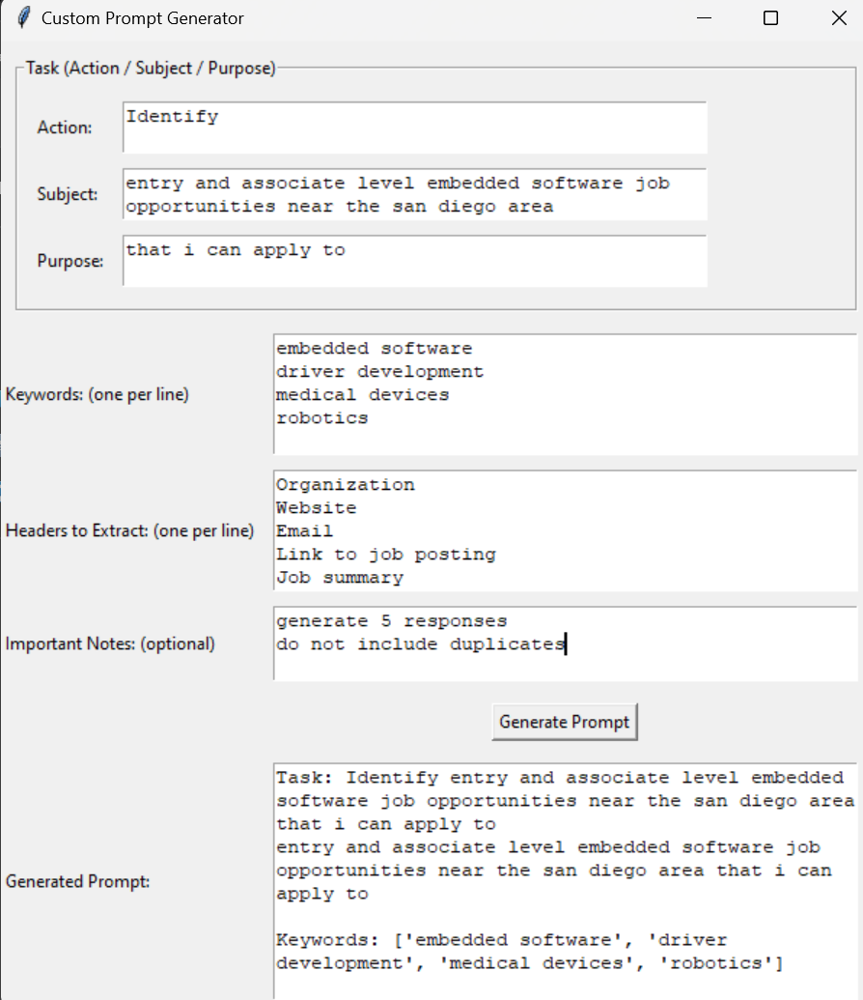
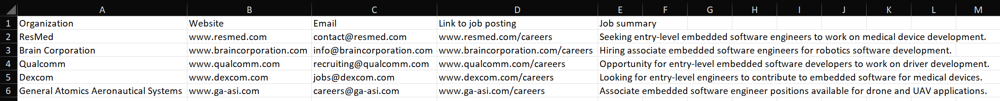

## Overview
This project demonstrates how to use OpenAI's API to generate responses using the gpt-3.5-turbo model and save the output to an Excel file. It provides the user with a GUI to generate a prompt which it then sends to the OpenAI API, and writes the response to an Excel file. ChatGPT can make mistakes, be sure to validate important info. 

The project was generated to assist with my personal research on topics, but I am currently working to customize it to be generalizable. Potentially useful topics to use it for:
1. Identifying potential business partnership collaborators
2. Sourcing supplies for components, supply chain management
3. Investor outreach
4. Market research, competetor analysis
5. Recruitment
6. Job searching
7. Finding organizations to get involved with related to a specific topic
8. Sales and distribution channel expansion

Ongoing Work:
1. Addressing problems with hallucination or adding secondary validation to information
2. Expand the script to enable handling larger number of outputs. Currently successful up to 10 contacts generated per prompt but ocassionally fails with larger generations.

## Prerequisites
- openai==0.10.2: For interacting with the OpenAI API. Install using `pip install openai`.
- openpyxl==3.0.9: For reading and writing Excel files. Install using `pip install openpyxl`.
- An OpenAI API key (https://platform.openai.com/playground)

## Installation

1. **Clone the repository**:
   - git clone repository-url
   - cd repository-directory
   
2. **Set up the virtual environment** (optional):
   - python -m venv venv
   - source venv/bin/activate  # On Windows, use venv\\Scripts\\activate
   
3. **Install the required packages**:
   - pip install openai openpyxl
   
4. **Set up the configuration**:
   - Create a .env file in the root directory in the format: OPENAI_API_KEY=your_API_key
   # IMPORTANT -- DO NOT REVEAL YOUR API KEY AS IT WILL GIVE OTHERS ACCESS TO YOUR OPENAI ACCOUNT. 
   - Ensure that it is placed only in the .env file you create.

## Usage
1. Navigate to the scripts folder and run: `python main.py`
2. You will be provided a GUI to fill out that will populate the prompt. After generation, the prompt can be found in the root directory.
    Sample: 
   - Note: In the root directory there is a `sample_prompt.txt` file to show the overall format and some basic suggestions to keep in mind when generating the prompt.
3. After closing the GUI, or after it expires (5 seconds after generating the prompt), the ChatGPT API will be called using your prompt, and the script will populate an Excel sheet in the data directory with a name related to the provided task.
    Sample: 

## Error Handling
- If the response is not a valid JSON string or not a list of dictionaries, the script will print an error message and exit.
